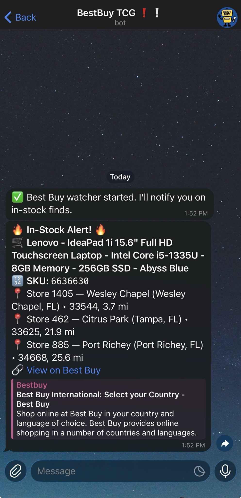

# 🛰️ SKU-Scout (BestBuy Stock Watcher)

**SKU-Scout** is a lightweight Python tool that monitors Best Buy product SKUs by ZIP code and radius, then sends instant **Telegram alerts** when nearby stores have in-stock availability.  

Perfect for tracking restocks, product drops, and local inventory — all with simple setup and real-time notifications.

---

## ✨ Features
- Track **multiple SKUs** using the official Best Buy API  
- Filter by ZIP code and distance (e.g., 30 miles around 12345)  
- Send **Telegram alerts** with product name, SKU, store names, and direct Best Buy links  
- Hourly uptime **heartbeat notifications** (configurable)  
- Avoid duplicate notifications with state persistence  
- Simple **batch manager** for easy start/stop/status/log access  

---

## 🚀 Quick Start

1. **Install Python 3.9 or later**

   Check your installation:
   ```bat
   python --version
2. Clone this repository
   ```bat
   git clone https://github.com/yourusername/sku-scout.git
   cd sku-scout

3. Create a virtual environment and install dependencies
   ```bat
   python -m venv venv
   venv\Scripts\pip install -U pip
   venv\Scripts\pip install requests python-dotenv tzdata

## ⚙️ Step 4: Configure Your Environment
Copy the example environment file:
   
Change .env.example -> .env 
   
## Then open .env in any text editor and fill in your details:

BESTBUY_API_KEY → from Best Buy Developer Portal

TELEGRAM_BOT_TOKEN → from @BotFather

TELEGRAM_CHAT_ID → from @userinfobot

ZIP_CODE and MAX_DISTANCE_MI → your preferred search area

(Optional) PRIORITY_STORE_IDS for your favorite store IDs

## 🧠 Step 5: Run the Watcher

Run directly from Python:
   
python bestbuy_restock_watcher_telegram_22s.py

Or use the Windows batch manager for easier control:

watcher_manager.bat

The manager provides:

Start / Stop / Restart

Live log view

Quick access to .env and logs

## ⚙️ Configuration Highlights

| Key                  | Example           | Description                       |
| -------------------- | ----------------- | --------------------------------- |
| `BESTBUY_API_KEY`    | `abc123xyz`       | Your Best Buy API key             |
| `TELEGRAM_BOT_TOKEN` | `123456:ABCxyz`   | Your Telegram bot token           |
| `TELEGRAM_CHAT_ID`   | `1231231234`      | Telegram user or group ID         |
| `ZIP_CODE`           | `00000`           | Your local ZIP code               |
| `MAX_DISTANCE_MI`    | `30`              | Search radius in miles            |
| `SKU_LIST`           | `1231234,1234567` | Comma-separated SKU list          |
| `POLL_EVERY_SECONDS` | `60`              | Polling frequency (seconds)       |
| `HEARTBEAT_ENABLED`  | `true`            | Sends hourly Telegram uptime ping |

## 💡 Tips

- Adjust your ZIP/radius to match your area.

- Add PRIORITY_STORE_IDS for faster lookups of preferred stores.

- Logs (restock.log) and states (availability_state.json) are stored locally.

- Increase polling interval if you hit API rate limits.

- Double-click watcher_manager.bat to control everything from Windows.

## 🪪 License

MIT License — Free to use, modify, and share.
Pull requests and community contributions are always welcome.

## ⚠️ Disclaimer

This project is unofficial and not affiliated with Best Buy.

Use responsibly and in compliance with Best Buy’s API Terms of Service.

[Best Buy API Documentation](https://developer.bestbuy.com/documentation)

[Best Buy API Terms of Service](https://developer.bestbuy.com/terms)

## 📸 Example Telegram Alert  

Below is an example of what a successful SKU-Scout Telegram notification looks like once your setup is complete.  

<p align="center">
  
</p>

The bot will send messages like this when a tracked SKU becomes available at your nearby Best Buy locations.  

Each alert includes:  
- 🔢 The product SKU  
- 🏬 Store name and location  
- 💲 Price details (if available)  
- 🔗 A direct link to view or purchase on BestBuy.com  
